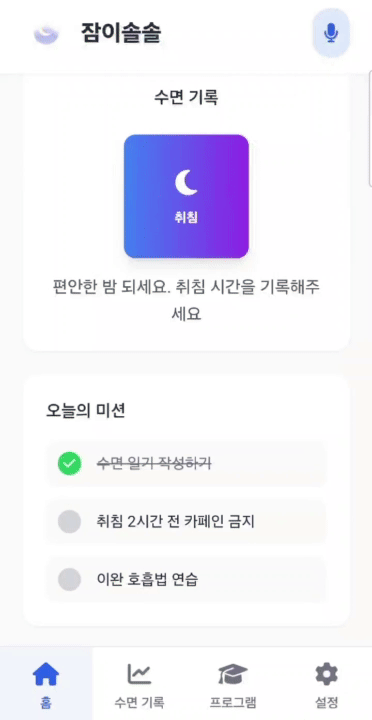
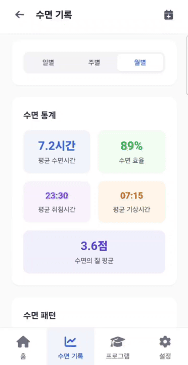
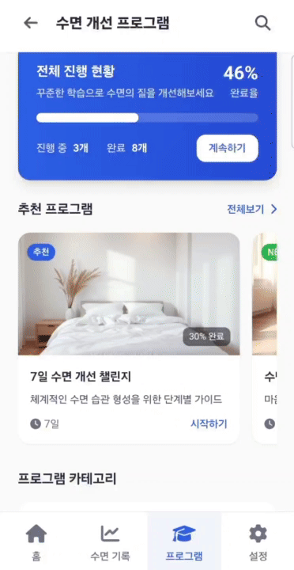

# 잠이솔솔 (CanSleep) 🌙

> **디지털 CBT-i 기반 시니어 친화형 수면 개선 앱 MVP**  
> 고령층을 위한 인지행동치료 기반 수면 장애 해결 솔루션
>
> **제2회 대한민국 학생 창업주간 프로그램 [A4]AX START UP 과정** 기획 아이디어

**🔗 데모 사이트**: [cansleep.kro.kr](https://cansleep.kro.kr)(모바일UI로 확인해주세요)

## 📱 프로젝트 소개

**잠이솔솔**은 국내 124만 명의 수면 장애 환자 중 70% 이상을 차지하는 고령층을 위한 **디지털 치료제(DTx) MVP 모델**입니다. 단순한 멜라토닌 보충의 한계를 넘어, **인지행동치료(CBT-i)** 기반의 구조적이고 장기적인 수면 개선 솔루션을 제공합니다.

### 🎯 핵심 가치
- **과학적 근거**: CBT-i 기반 메타분석 수준의 효과 (SMD ≈ -0.85)
- **시니어 친화**: 큰 버튼, 큰 글꼴, 직관적 내비게이션
- **개인화**: AI 챗봇 기반 맞춤형 수면 코칭
- **접근성**: 시간·장소 제약 없는 디지털 치료

## 🎬 시연 영상

| 메인 화면 및 수면 기록 | CBT-i 프로그램 관리 | 수면 패턴 분석 및 통계 |
|:---:|:---:|:---:|
|  |  |  |

## ✨ 주요 기능

### 🏠 홈 화면
- **원터치 수면 기록**: 직관적인 취침/기상 버튼
- **일일 미션**: 개인화된 수면 개선 과제
- **실시간 통계**: 수면 패턴 요약 정보
- **AI 음성 지원**: 시니어 친화적 음성 인터페이스

### 📚 CBT-i 프로그램
- **체계적 커리큘럼**: 7일/14일/21일 단계별 프로그램
- **진행률 추적**: 실시간 학습 진도 관리
- **카테고리별 학습**: 수면 교육, 이완 기법, 환경 최적화
- **개인 맞춤**: 사용자 수면 패턴 기반 추천

### 📊 수면 기록 & 분석
- **시각적 캘린더**: 월별 수면 품질 한눈에 보기
- **상세 통계**: 평균 수면시간, 효율성, 품질 점수
- **수면 노트**: 일일 수면 상태 기록 및 메모
- **패턴 분석**: 장기간 수면 트렌드 시각화

## 🛠 기술 스택

### Frontend
- **React 18.2.0**: 컴포넌트 기반 사용자 인터페이스
- **TypeScript 5.2.2**: 타입 안전성 보장
- **React Router DOM 6.20.0**: SPA 라우팅
- **Tailwind CSS 3.3.5**: 유틸리티 퍼스트 스타일링

### Build & Development
- **Vite 5.0.0**: 빠른 개발 서버 및 번들링
- **ESLint**: 코드 품질 관리
- **PostCSS & Autoprefixer**: CSS 후처리

### Deployment
- **GitHub Pages**: 정적 사이트 호스팅
- **Custom Domain**: cansleep.kro.kr

## 📈 사업적 가치

### 시장 규모
- **국내 수면 장애 시장**: 연 3,200억 원 (2023년)
- **디지털 헬스 시장**: 2024년 33억 달러 → 2030년 110억 달러 (CAGR 23%)
- **타겟 고령층**: 87만 명 (전체 환자의 70%)

### 경쟁 우위
- **멜라토닌 대비**: 구조적·장기적 개선 vs 단기적 진입 효과
- **면대면 CBT 대비**: 24/7 접근성, 비용 효율성
- **기존 앱 대비**: 시니어 특화 UX/UI, 한국형 콘텐츠

### 수익 모델
- **B2C**: 프리미엄 구독 (월 12,000원)
- **B2B**: 병원·기관 라이선스 (연 1,000만원~)
- **Payer**: 건강보험 급여 연동 (회당 35,000원)

## 👥 팀 정보

**팀장 및 개발**: 김인성
- 프로젝트 총괄 및 팀 리더
- React/TypeScript 기반 MVP 개발
- 시니어 친화적 UI/UX 구현

**사업 기획팀**:
- **김예림**: 시장조사 및 사업계획서 작성 지원
- **유창욱**: 사업계획서 작성 및 기술 검토 지원
- **최연**: 시장조사 및 보안 전략 기획

## 🎯 로드맵

### Phase 1: MVP 완성 (현재)
- ✅ 기본 UI/UX 구현
- ✅ 수면 기록 기능
- ✅ CBT-i 프로그램 구조
- ✅ 반응형 디자인

### Phase 2: 고도화 (예정X Q2)
- 🔄 AI 챗봇 통합
- 🔄 음성 인터페이스 고도화
- 🔄 개인화 알고리즘 구현
- 🔄 데이터 분석 기능 강화

### Phase 3: 사업화 (예정X Q3-Q4)
- 📋 디지털 치료제(DTx) 인증 준비
- 📋 병원 연동 시스템 구축
- 📋 보험 급여 등재 추진
- 📋 B2B 파트너십 확대

---

**잠이솔솔과 함께 건강한 수면 습관을 만들어보세요** 🌙✨

